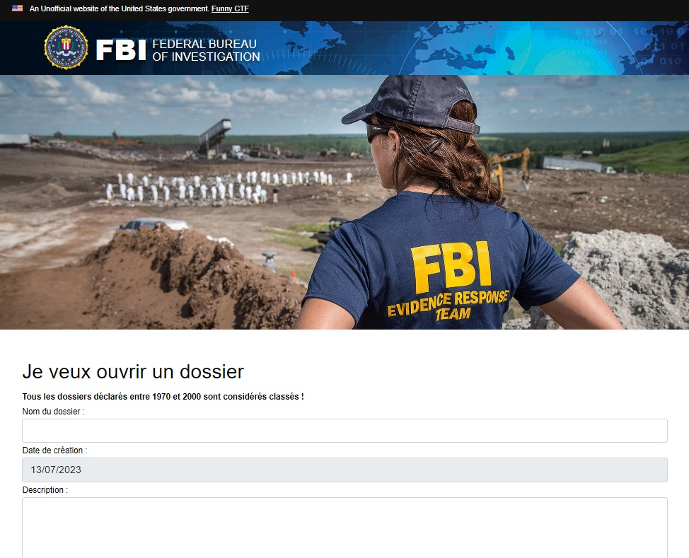

# CTF Web Serveur - Timestamp et 32bits

## Présentation du CTF 
**ID** 9 dans **les CTFs de Cyrhades**

Récupérer le flag en réussissant à soumettre un dossier en le faisant passer pour un dossier d'une date comprise entre 1970 à 2000.

## Aperçu

-----------

## Installation manuel
Vous n'utilisez pas l'application **les CTFs de Cyrhades** ? C'est dommage !
Mais voici comment installer ce CTF manuellement :

> git clone https://github.com/Hack-Oeil/CTF_AFFAIRE_CLASSEE.git

> cd CTF_AFFAIRE_CLASSEE && docker compose up

